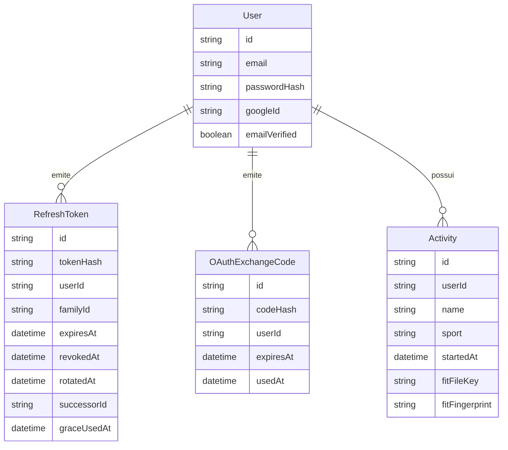

# Mapa do código — dutrail-api

Mapa do código: estrutura, responsabilidades e onde cada coisa vive.
Complementa o [`HTTP-MAP.md`](HTTP-MAP.md) (que descreve o comportamento das
rotas) com a organização interna, para quem está navegando pelo código deste
repositório.

## Stack

NestJS sobre Express, TypeScript (ESM, saída `nodenext`). Persistência com
Prisma 7 (driver adapter `pg`) sobre Postgres. Autenticação com Passport
(`passport-jwt` para o access token, `passport-google-oauth20` para o login
com Google), JWT (`@nestjs/jwt`), hash de senha com Argon2id. Validação com
`class-validator`/`class-transformer`. Rate limit com `@nestjs/throttler`,
cabeçalhos de segurança com `helmet`, job agendado com `@nestjs/schedule`.
Upload para um bucket S3-compatível (`@aws-sdk/client-s3`) e leitura de
arquivos FIT com `@garmin/fitsdk`. Testes com Vitest (unitários e e2e) e
Supertest; lint com `oxlint`; formatação com Prettier.

## Estrutura de `src/`

Do mais externo (bootstrap e configuração) ao mais interno (banco e
storage):

- **`main.ts`** — ponto de entrada: cria a aplicação Nest, chama
  `configureApp` e sobe o servidor HTTP.
- **`app.module.ts`** — módulo raiz: importa `ConfigModule` (carrega e
  valida o `.env`), `ThrottlerModule` (limite global), `ScheduleModule`
  (condicional, para o job de limpeza), e os módulos de domínio. Registra o
  `ThrottlerGuard` e o `AllExceptionsFilter` como globais.
- **`app.setup.ts`** — o que não cabe em módulos: Helmet, `cookie-parser`,
  `ValidationPipe` global, CORS, `trust proxy`, e o Swagger fora de
  produção. Separado do `main.ts` para os testes e2e subirem a aplicação do
  mesmo jeito que em produção.
- **`config/`** — `env.validation.ts`: contrato e validação de toda
  variável de ambiente, rodada uma única vez no boot.
- **`common/`** — o que não pertence a um domínio específico:
  - `decorators/`: `@Public()` (opt-out do guard global), `@CurrentUser()`
    (lê `req.user`), `@ClientType()`/`parseClientType` (header
    `X-Client-Type`).
  - `dto/`: `ErrorResponseDto`, o formato único de erro.
  - `filters/`: `AllExceptionsFilter`, o filtro global de exceções.
- **`security/`** — `SecurityLogService` e `SecurityContext`: o log
  estruturado de eventos de segurança, usado por `auth/` e pelo filtro
  global.
- **`auth/`** — autenticação e sessão; o módulo maior do projeto:
  - `auth.controller.ts`, `auth.service.ts`: as rotas `/auth/*` e os casos
    de uso (cadastro, login, refresh, logout, login com Google).
  - `token.service.ts`: emissão, rotação e revogação de JWT.
  - `password.service.ts`, `breached-password.service.ts`: hash/verificação
    de senha e checagem de senha vazada.
  - `login-attempts.service.ts`, `login-attempts.store.ts`: limite de login
    por conta.
  - `refresh-token-transport.service.ts`: por onde o refresh token entra e
    sai (cookie vs corpo).
  - `oauth-state.store.ts`, `oauth-state-cookie.ts`, `google-callback.ts`:
    `state`/PKCE do login com Google e a classificação de erros do
    callback.
  - `expired-tokens-cleanup.service.ts`: job diário de limpeza.
  - `guards/`, `strategies/`, `filters/`, `decorators/`, `interfaces/`,
    `dto/`: guards (`JwtAuthGuard`, `GoogleAuthGuard`,
    `GoogleCallbackGuard`), strategies do Passport (`JwtStrategy`,
    `GoogleStrategy`), o `GoogleCallbackFilter`, DTOs das rotas e interfaces
    de payload/perfil.
- **`users/`** — `UsersService` (acesso a dados de usuário, sem saber nada
  de senha/token) e `UsersController` (`GET /me`).
- **`activities/`** — atividades:
  - `activities.controller.ts`, `activities.service.ts`: listagem, detalhe
    e importação.
  - `activity-cursor.ts`: paginação por cursor opaco.
  - `fit/fit-activity-parser.ts`: leitura de arquivos `.fit`.
  - `storage/activity-file-storage.service.ts`: upload/remoção no bucket
    S3-compatível.
- **`prisma/`** — `PrismaService`, o wrapper injetável do `PrismaClient`
  (conecta no boot, desconecta no shutdown).
- **`generated/prisma/`** — código gerado pelo Prisma a partir de
  `prisma/schema.prisma` (`npm run prisma:generate`); não é editado à mão.

## O que fica fora de `src/`

- **`prisma/schema.prisma`** e **`prisma/migrations/`** — o modelo de dados
  e o histórico de migrations (`npm run prisma:migrate` em dev,
  `prisma:deploy` em produção).
- **`scripts/generate-openapi.mjs`** — gera `docs/openapi.json` subindo a
  aplicação compilada sem banco (`npm run openapi:generate`).
  **`scripts/init-test-db.sql`** — cria o banco `dutrail_test` na primeira
  subida do Postgres local (`compose.yaml`).
- **`test/`** — infraestrutura de testes e2e: os arquivos `*.e2e-spec.ts`
  (um por área), `test/global-setup.ts` (aplica as migrations antes da
  suíte), `test/utils/` (sobe a aplicação, client HTTP, captura de log),
  `test/fakes/` (dublês de Google, storage e checagem de senha vazada) e
  `test/fixtures/` (arquivo `.fit` de exemplo). Os testes unitários (`*.spec.ts`)
  ficam ao lado do código que testam, dentro de `src/`.
- **`compose.yaml`** — Postgres local para desenvolvimento e para os e2e
  (nunca produção).
- **`prisma7.config.ts`** — configuração da CLI do Prisma (schema,
  migrations, `DATABASE_URL`).
- **`.env.example`** — modelo de todas as variáveis de ambiente, só com
  placeholders.

## Onde mora cada coisa

| Responsabilidade                              | Arquivo/classe                                                                                                                                                                                                                         | Teste que a cobre                                                                                                            |
| --------------------------------------------- | -------------------------------------------------------------------------------------------------------------------------------------------------------------------------------------------------------------------------------------- | ---------------------------------------------------------------------------------------------------------------------------- |
| Hash de senha                                 | `PasswordService` (`src/auth/password.service.ts`)                                                                                                                                                                                     | `src/auth/password.service.spec.ts`                                                                                          |
| Emissão e verificação de JWT                  | `TokenService.signTokenPair`/`verifyRefreshJwt` (`src/auth/token.service.ts`); `JwtStrategy` (`src/auth/strategies/jwt.strategy.ts`)                                                                                                   | `src/auth/token.service.spec.ts`, `test/jwt-env.e2e-spec.ts`                                                                 |
| Rotação de refresh token                      | `TokenService.rotateRefreshToken` (`src/auth/token.service.ts`)                                                                                                                                                                        | `src/auth/token.service.spec.ts`, `test/refresh-token-families.e2e-spec.ts`                                                  |
| Famílias de refresh token                     | `RefreshToken.familyId` (`prisma/schema.prisma`); `TokenService.handleRotatedToken`                                                                                                                                                    | `test/refresh-token-families.e2e-spec.ts`                                                                                    |
| `state`/PKCE do login com Google              | `OAuthStateStore` (`src/auth/oauth-state.store.ts`), funções de `src/auth/oauth-state-cookie.ts`, `GoogleStrategy` (`src/auth/strategies/google.strategy.ts`)                                                                          | `src/auth/oauth-state.store.spec.ts`, `src/auth/oauth-state-cookie.spec.ts`, `test/google-oauth.e2e-spec.ts`                 |
| Rate limit (por IP e por conta)               | `ThrottlerGuard` global (`src/app.module.ts`) + `@Throttle()` por rota (`src/auth/auth.controller.ts`, `src/activities/activities.controller.ts`); `LoginAttemptsService` (`src/auth/login-attempts.service.ts`)                       | `test/rate-limit.e2e-spec.ts`, `src/auth/login-attempts.service.spec.ts`                                                     |
| Logs de segurança                             | `SecurityLogService` (`src/security/security-log.service.ts`)                                                                                                                                                                          | `src/security/security-log.service.spec.ts`, `test/security-log.e2e-spec.ts`                                                 |
| Purga de tokens expirados                     | `ExpiredTokensCleanupService.purgeExpired` (`src/auth/expired-tokens-cleanup.service.ts`)                                                                                                                                              | `src/auth/expired-tokens-cleanup.service.spec.ts`, `test/expired-tokens-cleanup.e2e-spec.ts`                                 |
| Validação de variáveis de ambiente            | `validateEnv`/`EnvironmentVariables` (`src/config/env.validation.ts`)                                                                                                                                                                  | `src/config/env.validation.spec.ts`, `test/jwt-env.e2e-spec.ts`                                                              |
| Upload/importação de arquivo `.fit`           | `ActivitiesService.importFitFile` (`src/activities/activities.service.ts`); `parseFitActivity` (`src/activities/fit/fit-activity-parser.ts`); `ActivityFileStorageService` (`src/activities/storage/activity-file-storage.service.ts`) | `src/activities/fit/fit-activity-parser.spec.ts`, `src/activities/activities.service.spec.ts`, `test/activities.e2e-spec.ts` |
| Paginação por cursor                          | `encodeActivityCursor`/`decodeActivityCursor` (`src/activities/activity-cursor.ts`); `ActivitiesService.listForUser`                                                                                                                   | `src/activities/activity-cursor.spec.ts`, `test/activities.e2e-spec.ts`                                                      |
| Transporte do refresh token (cookie vs corpo) | `RefreshTokenTransport` (`src/auth/refresh-token-transport.service.ts`)                                                                                                                                                                | `src/auth/refresh-token-transport.service.spec.ts`, `test/refresh-cookie-by-env.e2e-spec.ts`                                 |
| IP do cliente atrás de proxy                  | `parseTrustProxy` (`src/config/env.validation.ts`), aplicado em `configureApp` (`src/app.setup.ts`)                                                                                                                                    | `src/config/env.validation.spec.ts`, `test/rate-limit.e2e-spec.ts` (describe "TRUST_PROXY")                                  |
| Formato único de erro                         | `AllExceptionsFilter` (`src/common/filters/all-exceptions.filter.ts`); `ErrorResponseDto` (`src/common/dto/error-response.dto.ts`)                                                                                                     | `src/common/filters/all-exceptions.filter.spec.ts`                                                                           |
| Isolamento entre usuários (atividades)        | `ActivitiesService` — todo acesso filtra por `userId` do token (`findForUser`, `listForUser`, `importFitFile`)                                                                                                                         | `src/activities/activities.service.spec.ts`, `test/activities.e2e-spec.ts`                                                   |

## Achados da auditoria → código

Os 21 achados de `SECURITY-AUDIT.md`, onde cada correção vive e o teste que
a protege. Detalhe de cada um nas [Notas de correção](SECURITY-AUDIT.md#notas-de-correção)
do próprio relatório.

| ID                             | Achado                                                             | Onde a correção vive                                                                                                                                                                 | Teste que a protege                                                                                                                                                |
| ------------------------------ | ------------------------------------------------------------------ | ------------------------------------------------------------------------------------------------------------------------------------------------------------------------------------ | ------------------------------------------------------------------------------------------------------------------------------------------------------------------ |
| [A-01](SECURITY-AUDIT.md#a-01) | Account pre-hijacking na vinculação com o Google                   | `AuthService.loginWithGoogle`/`takeOverUnverifiedAccount` (`src/auth/auth.service.ts`); `UsersService.linkGoogleAccount` (`src/users/users.service.ts`)                              | `src/auth/auth.service.spec.ts`, `test/auth.e2e-spec.ts`                                                                                                           |
| [A-02](SECURITY-AUDIT.md#a-02) | Login com Google sem `state`/PKCE                                  | `GoogleStrategy` (`src/auth/strategies/google.strategy.ts`); `OAuthStateStore`, `src/auth/oauth-state-cookie.ts`; `GoogleCallbackGuard` (`src/auth/guards/google-callback.guard.ts`) | `test/google-oauth.e2e-spec.ts`, `src/auth/oauth-state.store.spec.ts`, `src/auth/oauth-state-cookie.spec.ts`, `src/auth/guards/google-callback.guard.spec.ts`      |
| [A-03](SECURITY-AUDIT.md#a-03) | Rate limit só por IP, sem `trust proxy` nem limite por conta       | `parseTrustProxy` (`src/config/env.validation.ts`); `LoginAttemptsService` (`src/auth/login-attempts.service.ts`); `@Throttle()` por rota (`src/auth/auth.controller.ts`)            | `test/rate-limit.e2e-spec.ts`, `src/auth/login-attempts.service.spec.ts`, `src/config/env.validation.spec.ts`, `src/app.setup.spec.ts`                             |
| [A-04](SECURITY-AUDIT.md#a-04) | Reuso de refresh token sem família, sem janela de tolerância       | `RefreshToken.familyId`/`rotatedAt`/`successorId`/`graceUsedAt` (`prisma/schema.prisma`); `TokenService.rotateRefreshToken`/`handleRotatedToken` (`src/auth/token.service.ts`)       | `test/refresh-token-families.e2e-spec.ts`, `src/auth/token.service.spec.ts`                                                                                        |
| [A-05](SECURITY-AUDIT.md#a-05) | Validação de segredos aceita placeholders; `NODE_ENV` falha aberto | `validateEnv`/`checkProductionCredentials` (`src/config/env.validation.ts`)                                                                                                          | `src/config/env.validation.spec.ts`                                                                                                                                |
| [A-06](SECURITY-AUDIT.md#a-06) | Sem cabeçalhos de segurança                                        | `securityHeaders` (`src/app.setup.ts`)                                                                                                                                               | `test/security-headers.e2e-spec.ts`                                                                                                                                |
| [A-07](SECURITY-AUDIT.md#a-07) | Nenhum log de eventos de segurança                                 | `SecurityLogService` (`src/security/security-log.service.ts`)                                                                                                                        | `src/security/security-log.service.spec.ts`, `test/security-log.e2e-spec.ts`                                                                                       |
| [A-08](SECURITY-AUDIT.md#a-08) | Sem "sair de todos os dispositivos"                                | `AuthController.logoutAll`/`AuthService.logoutAll` (`src/auth/auth.controller.ts`, `src/auth/auth.service.ts`)                                                                       | `test/logout-all.e2e-spec.ts`, `src/auth/auth.service.spec.ts`                                                                                                     |
| [A-09](SECURITY-AUDIT.md#a-09) | Senha abaixo do ASVS, sem normalização Unicode                     | `PasswordService` (NFKC, `src/auth/password.service.ts`); `BreachedPasswordService` (`src/auth/breached-password.service.ts`)                                                        | `test/password-normalization.e2e-spec.ts`, `test/breached-password.e2e-spec.ts`, `src/auth/password.service.spec.ts`, `src/auth/breached-password.service.spec.ts` |
| [A-10](SECURITY-AUDIT.md#a-10) | Swagger exposto incondicionalmente                                 | `shouldSetupSwagger` (`src/app.setup.ts`)                                                                                                                                            | `test/swagger-by-env.e2e-spec.ts`                                                                                                                                  |
| [A-11](SECURITY-AUDIT.md#a-11) | Cookie com `Max-Age` fixo e `Secure` condicionado                  | `COOKIE_SECURE` (`src/config/env.validation.ts`); `RefreshTokenTransport` (`src/auth/refresh-token-transport.service.ts`)                                                            | `test/refresh-cookie-by-env.e2e-spec.ts`, `src/auth/refresh-token-transport.service.spec.ts`                                                                       |
| [A-12](SECURITY-AUDIT.md#a-12) | Sem limpeza de tokens expirados                                    | `ExpiredTokensCleanupService` (`src/auth/expired-tokens-cleanup.service.ts`)                                                                                                         | `test/expired-tokens-cleanup.e2e-spec.ts`, `src/auth/expired-tokens-cleanup.service.spec.ts`                                                                       |
| [A-13](SECURITY-AUDIT.md#a-13) | Erros do callback do Google terminam no domínio da API             | `src/auth/google-callback.ts`; `GoogleCallbackGuard`, `GoogleCallbackFilter` (`src/auth/guards/google-callback.guard.ts`, `src/auth/filters/google-callback.filter.ts`)              | `test/google-oauth.e2e-spec.ts`, `src/auth/filters/google-callback.filter.spec.ts`, `src/auth/guards/google-callback.guard.spec.ts`                                |
| [A-14](SECURITY-AUDIT.md#a-14) | JWT sem `iss`/`aud`; algoritmo do refresh não fixado; TTL sem teto | `src/auth/jwt.constants.ts`; `TokenService`, `JwtStrategy`; TTL em `src/config/env.validation.ts`                                                                                    | `src/auth/token.service.spec.ts`, `src/config/env.validation.spec.ts`, `test/auth.e2e-spec.ts`, `test/jwt-env.e2e-spec.ts`                                         |
| [A-15](SECURITY-AUDIT.md#a-15) | Vulnerabilidades do `npm audit`                                    | `overrides` e script `audit:prod` (`package.json`)                                                                                                                                   | **Sem teste automatizado** — conferido manualmente com `npm audit --omit=dev`                                                                                      |
| [A-16](SECURITY-AUDIT.md#a-16) | Signup responde 409 para email existente (enumeração)              | Risco aceito; nenhuma mudança de código                                                                                                                                              | `test/security-log.e2e-spec.ts` cobre o evento `signup_conflict` associado                                                                                         |
| [A-17](SECURITY-AUDIT.md#a-17) | Rotação de refresh token não transacional                          | `TokenService.rotateRefreshToken` dentro de `prisma.$transaction`                                                                                                                    | `test/refresh-token-families.e2e-spec.ts`, `src/auth/token.service.spec.ts`                                                                                        |
| [A-18](SECURITY-AUDIT.md#a-18) | Mensagens de 401 distintas por motivo                              | `INVALID_REFRESH_TOKEN_MESSAGE` (`src/auth/jwt.constants.ts`), usada em `src/auth/token.service.ts`                                                                                  | `test/security-log.e2e-spec.ts`, `test/auth.e2e-spec.ts`, `src/auth/token.service.spec.ts`                                                                         |
| [A-19](SECURITY-AUDIT.md#a-19) | Log de 5xx grava a query string (inclui `code` do Google)          | `AllExceptionsFilter` loga `request.path` (`src/common/filters/all-exceptions.filter.ts`)                                                                                            | `src/common/filters/all-exceptions.filter.spec.ts`, `test/auth.e2e-spec.ts`                                                                                        |
| [A-20](SECURITY-AUDIT.md#a-20) | Postgres de dev publicado em todas as interfaces                   | `compose.yaml` (bind `127.0.0.1:5433:5432`)                                                                                                                                          | **Sem teste automatizado** — conferido manualmente com `podman ps`/`docker ps`                                                                                     |
| [A-21](SECURITY-AUDIT.md#a-21) | Access token leva o email em claro                                 | `AccessTokenPayload` (`src/auth/interfaces/jwt-payload.interface.ts`); `TokenService`                                                                                                | `test/password-normalization.e2e-spec.ts`, `src/auth/token.service.spec.ts`                                                                                        |

## Variáveis de ambiente

Contrato completo em `src/config/env.validation.ts`. "Obrigatória em
produção?" aqui significa "sem padrão: falta fazer o boot falhar, em
qualquer ambiente" — algumas têm ainda uma regra extra só em produção,
citada na finalidade.

| Nome                           | Finalidade                                                                                                        | Obrigatória em produção? | Padrão (se não for segredo) |
| ------------------------------ | ----------------------------------------------------------------------------------------------------------------- | ------------------------ | --------------------------- |
| `NODE_ENV`                     | Ambiente de execução (`development`/`test`/`production`); muda Swagger, cookie `Secure`, validação de credenciais | Sim                      | — (sem padrão)              |
| `PORT`                         | Porta HTTP                                                                                                        | Não                      | `3000`                      |
| `FRONTEND_URL`                 | Origem única liberada no CORS; destino dos redirects do login com Google                                          | Sim                      | — (sem padrão)              |
| `COOKIE_SECURE`                | Flag `Secure` do cookie do refresh token e do `state` do Google; não pode ser `false` em produção                 | Sim                      | `true`                      |
| `SECURITY_LOG_ENABLED`         | Liga/desliga o log de eventos de segurança                                                                        | Não                      | `true`                      |
| `SCHEDULER_ENABLED`            | Liga/desliga o job diário de limpeza de tokens expirados                                                          | Não                      | `true`                      |
| `DATABASE_URL`                 | String de conexão do Postgres                                                                                     | Sim                      | — (segredo)                 |
| `JWT_SECRET`                   | Segredo de assinatura do access token; mínimo de 43 caracteres e sem trecho de placeholder em produção            | Sim                      | — (segredo)                 |
| `JWT_REFRESH_SECRET`           | Segredo de assinatura do refresh token; precisa ser diferente de `JWT_SECRET`; mesma regra extra em produção      | Sim                      | — (segredo)                 |
| `JWT_ISSUER`                   | Claim `iss` dos dois tokens                                                                                       | Não                      | `dutrail-api`               |
| `JWT_ACCESS_TTL`               | Validade do access token (teto 1h)                                                                                | Não                      | `15m`                       |
| `JWT_REFRESH_TTL`              | Validade do refresh token (teto 30d)                                                                              | Não                      | `7d`                        |
| `REFRESH_GRACE_SECONDS`        | Janela de tolerância do refresh token recém-rotacionado (0 desativa; teto 60)                                     | Não                      | `30`                        |
| `TRUST_PROXY`                  | Quantos saltos de proxy confiar para o `X-Forwarded-For` (rate limit e log de segurança)                          | Não                      | `false` (desligado)         |
| `LOGIN_MAX_FAILURES`           | Falhas de login por conta antes do 429                                                                            | Não                      | `5`                         |
| `LOGIN_FAILURE_WINDOW_MINUTES` | Janela do limite de login por conta                                                                               | Não                      | `15`                        |
| `GOOGLE_CLIENT_ID`             | Client ID do OAuth do Google                                                                                      | Sim                      | — (sem padrão)              |
| `GOOGLE_CLIENT_SECRET`         | Client secret do OAuth do Google                                                                                  | Sim                      | — (segredo)                 |
| `GOOGLE_CALLBACK_URL`          | URL do callback cadastrada no Google Console (o caminho precisa ser `/auth/google/callback`)                      | Sim                      | — (sem padrão)              |
| `OCI_S3_ENDPOINT`              | Endpoint do bucket S3-compatível                                                                                  | Sim                      | — (sem padrão)              |
| `OCI_S3_REGION`                | Região do bucket                                                                                                  | Sim                      | — (sem padrão)              |
| `OCI_S3_BUCKET`                | Nome do bucket                                                                                                    | Sim                      | — (sem padrão)              |
| `OCI_S3_ACCESS_KEY`            | Credencial de acesso ao bucket                                                                                    | Sim                      | — (segredo)                 |
| `OCI_S3_SECRET_KEY`            | Credencial de acesso ao bucket                                                                                    | Sim                      | — (segredo)                 |
| `BREACHED_PASSWORD_CHECK`      | Liga/desliga a consulta ao Have I Been Pwned no cadastro                                                          | Não                      | `true`                      |
| `BREACHED_PASSWORD_TIMEOUT_MS` | Timeout da consulta de senha vazada (100–10000)                                                                   | Não                      | `2000`                      |
| `THROTTLE_TTL_MS`              | Janela do limite global por IP                                                                                    | Não                      | `60000`                     |
| `THROTTLE_LIMIT`               | Quantidade de requests por janela no limite global por IP                                                         | Não                      | `100`                       |

## Modelo de dados

- **`User`** — uma conta: email e senha (opcional, para contas só-Google),
  identidade do Google e dados básicos de perfil.
- **`RefreshToken`** — uma linha por refresh token emitido; guarda só o
  SHA-256 do token.
- **`OAuthExchangeCode`** — o código de uso único trocado por tokens depois
  do callback do Google.
- **`Activity`** — uma atividade importada de um arquivo `.fit`, com o
  resumo da sessão e a referência ao arquivo original no storage.

A coluna `familyId` de `RefreshToken` é a família: todos os refresh tokens
de uma mesma sessão (um login, em um dispositivo) compartilham o mesmo
`familyId`, atribuído no login/cadastro/troca do Google e herdado a cada
rotação. Reuso detectado apaga só as linhas daquela família — as sessões de
outros dispositivos do mesmo usuário não são afetadas.

## Navegando pelo código

Passos de um `POST /auth/login`, do request ao banco, com os testes de
referência de cada um:

1. **`main.ts`/`app.setup.ts`** — a requisição passa por Helmet,
   `cookie-parser`, corpo JSON e CORS antes de chegar ao roteamento. Testes:
   `test/security-headers.e2e-spec.ts`.
2. **`ThrottlerGuard`** (global, `src/app.module.ts`) conta a tentativa
   contra o limite por IP da rota (`@Throttle()` em
   `src/auth/auth.controller.ts`). Teste: `test/rate-limit.e2e-spec.ts`.
3. **`JwtAuthGuard`** (global, `src/auth/guards/jwt-auth.guard.ts`) vê
   `@Public()` em `login` e libera sem conferir `Authorization`. Testes:
   `test/auth.e2e-spec.ts`, `test/security-headers.e2e-spec.ts`.
4. **`ValidationPipe`** global valida o `LoginDto`
   (`src/auth/dto/login.dto.ts`) e o decorator `@ClientType()`
   (`src/common/decorators/client-type.decorator.ts`) valida o header
   `X-Client-Type`. Teste: `src/common/decorators/client-type.decorator.spec.ts`.
5. **`AuthController.login`** (`src/auth/auth.controller.ts`) monta o
   `SecurityContext` e chama `AuthService.login`.
6. **`AuthService.login`** (`src/auth/auth.service.ts`) conta a tentativa
   no `LoginAttemptsService` (limite por conta), busca o usuário e verifica
   a senha com `PasswordService` (Argon2id). Testes:
   `src/auth/auth.service.spec.ts`, `src/auth/login-attempts.service.spec.ts`,
   `src/auth/password.service.spec.ts`.
7. **`TokenService.issueTokenPair`** (`src/auth/token.service.ts`) assina o
   access e o refresh token e grava o hash do refresh no banco, numa
   família nova, via `PrismaService`. Teste: `src/auth/token.service.spec.ts`.
8. **`RefreshTokenTransport.deliver`** entrega o refresh token (cookie ou
   corpo, conforme `X-Client-Type`) e `SecurityLogService` registra
   `login_success`. Testes: `src/auth/refresh-token-transport.service.spec.ts`,
   `test/security-log.e2e-spec.ts`.
