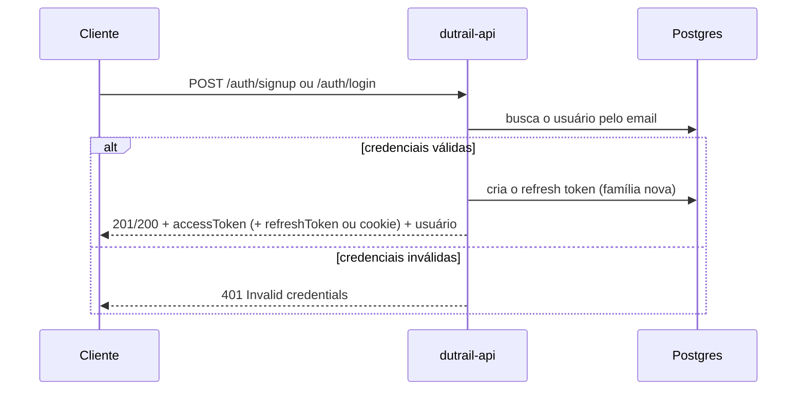
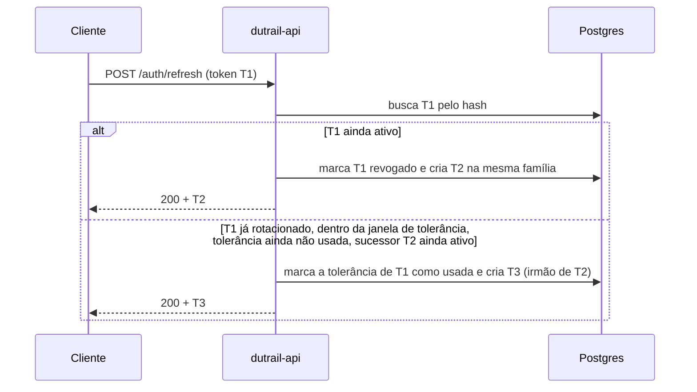
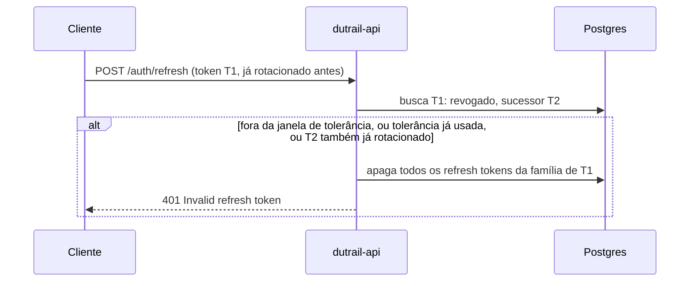
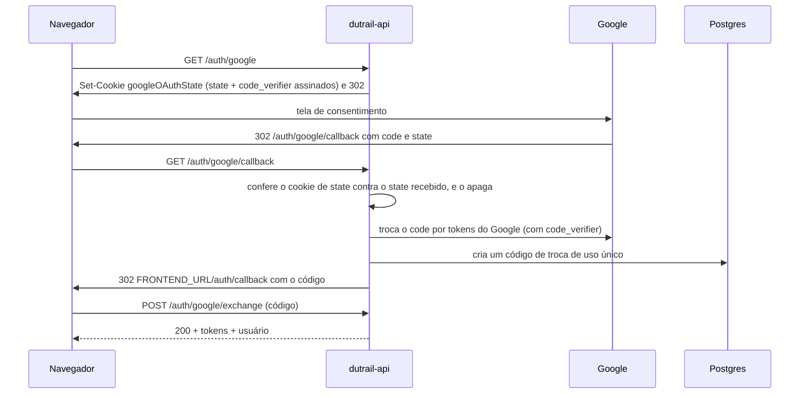
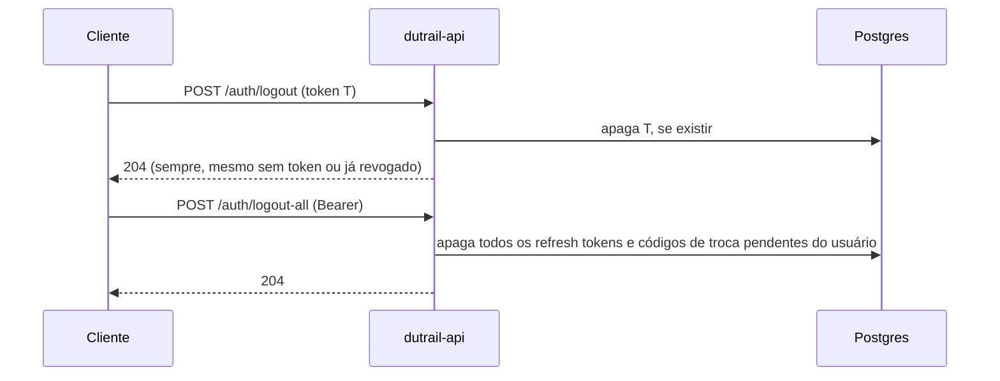
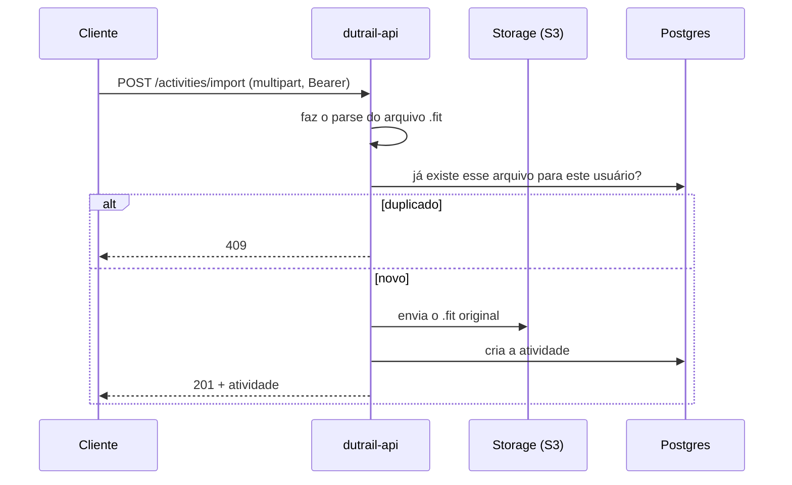

# Mapa HTTP — dutrail-api

Mapa de todas as rotas HTTP expostas pela API, dos comportamentos que valem
para qualquer rota e dos fluxos entre rotas (login, refresh, importação).
Complementa os contratos (`API-CONTRACT.md`, `ACTIVITIES-CONTRACT.md`,
`AUTH-CONTRACT-MOBILE.md`), que são a referência normativa para quem integra
um cliente; este documento descreve o comportamento a partir do código, para
quem mantém a API.

Verificado contra o código (controllers, guards, filtros, decorators de
`@Throttle`, DTOs) e contra `docs/openapi.json`. Os itens marcados
"(medido)" foram confirmados subindo a aplicação compilada sem banco, do
mesmo jeito que `scripts/generate-openapi.mjs`, e testando com requisições
reais.

## Comportamentos globais

### Formato de erro

Todo erro — de qualquer rota, inclusive os que o framework gera antes de
chegar a um controller — tem o mesmo formato (`ErrorResponseDto`, em
`src/common/dto/error-response.dto.ts`):

```json
{
  "statusCode": 400,
  "error": "Bad Request",
  "message": "descrição única, ou uma lista de descrições",
  "path": "/auth/login",
  "timestamp": "2026-10-08T12:00:00.000Z"
}
```

Quem produz esse corpo é o `AllExceptionsFilter`
(`src/common/filters/all-exceptions.filter.ts`), registrado como filtro
global. `message` é string para a maioria dos erros e array só para os de
validação do `ValidationPipe` (um item por regra violada).

O filtro só reconhece três formas de erro: `HttpException` (e subclasses do
Nest), os códigos conhecidos do Prisma (`P2002` → 409, `P2025` → 404) e, para
qualquer outra coisa, um 500 genérico sem detalhe (a mensagem original só vai
para o log). Antes de chegar ao filtro, o próprio Nest já converte alguns
erros de baixo nível em `HttpException`:

- um `SyntaxError` de JSON malformado ou um `URIError` de `%` inválido na URL
  viram `BadRequestException` (400) — conversão do adaptador do Express
  (`mapException`, em `@nestjs/platform-express`), não deste projeto;
- erros do `multer` (upload multipart) viram `BadRequestException` (campo ou
  arquivo inesperado) ou `PayloadTooLargeException` (413, arquivo maior que o
  limite da rota) — conversão do `@nestjs/platform-express`, usada em
  `POST /activities/import`.

O corpo acima **excedendo** o limite padrão do `body-parser` (~100 KiB) não
passa por nenhuma dessas conversões: o erro (`PayloadTooLargeError`, sem ser
`HttpException`) cai no 500 genérico em vez de 413. Ver
[Divergências conhecidas](#divergências-conhecidas-backlog).

### Headers

- `Authorization: Bearer <accessToken>` — exigido por toda rota que não tem
  `@Public()` (decorator em `src/common/decorators/public.decorator.ts`),
  conferido pelo `JwtAuthGuard` global (`src/auth/guards/jwt-auth.guard.ts`).
- `X-Client-Type: web|mobile` — exigido pelas rotas que entregam ou recebem o
  refresh token (`signup`, `login`, `refresh`, `logout`, `logout-all`,
  `google/exchange`); ausente ou com outro valor é 400. Validado pelo
  decorator `@ClientType()` (`src/common/decorators/client-type.decorator.ts`).
  `GET /auth/google` e `GET /auth/google/callback` não o usam: são navegação
  de browser, que não permite headers customizados.
- `Retry-After` (segundos) — enviado em toda resposta 429 (limite por IP ou
  por conta) e incluído em `Access-Control-Expose-Headers`, para o
  JavaScript do cliente web conseguir lê-lo (sem isso o browser só expõe os
  headers "simples" por padrão). Configurado em `enableCors()`
  (`src/app.setup.ts`).

### Cookies

| Cookie             | Rota que define                                                  | Atributos                                                                      | Escopo (`Path`) | Vida                                    | O que cada cliente faz                                                                                                                                                                                  |
| ------------------ | ---------------------------------------------------------------- | ------------------------------------------------------------------------------ | --------------- | --------------------------------------- | ------------------------------------------------------------------------------------------------------------------------------------------------------------------------------------------------------- |
| `refreshToken`     | `signup`, `login`, `refresh`, `google/exchange` (clientes `web`) | `HttpOnly`, `Secure` (padrão; `COOKIE_SECURE=false` só em dev), `SameSite=Lax` | `/auth`         | igual ao `exp` do refresh token emitido | Web: o browser envia e recebe automaticamente; o JS nunca o lê. Mobile: nunca é setado — o refresh vai no corpo JSON                                                                                    |
| `googleOAuthState` | `GET /auth/google`                                               | `HttpOnly`, `Secure` (idem), `SameSite=Lax`                                    | `/auth/google`  | 10 min (`OAUTH_STATE_TTL_MS`)           | Só o browser (fluxo web); apagado incondicionalmente na entrada de `GET /auth/google/callback`, antes de qualquer outra checagem (`GoogleCallbackGuard`, em `src/auth/guards/google-callback.guard.ts`) |

Definidos em `RefreshTokenTransport` (`src/auth/refresh-token-transport.service.ts`)
e `OAuthStateStore` (`src/auth/oauth-state.store.ts`). Nenhum dos dois tem o
prefixo `__Secure-` (risco aceito A-11 em `SECURITY-AUDIT.md`).

### Ordem real entre JSON malformado, throttler e guards (medido)

A ordem efetiva, da entrada da requisição até o controller, é:

1. Helmet (cabeçalhos de segurança — presentes mesmo em erros de qualquer
   camada seguinte, inclusive JSON malformado);
2. `cookie-parser`;
3. corpo da requisição (`express.json()`/`urlencoded()`, registrado pelo
   próprio Nest);
4. CORS;
5. guards globais, nesta ordem: `ThrottlerGuard` e depois `JwtAuthGuard`
   (`src/app.module.ts` e `src/auth/auth.module.ts`);
6. interceptors de rota (ex.: `FileInterceptor` em `POST /activities/import`);
7. `ValidationPipe` e decorators de parâmetro (`@Body()`, `@Query()`,
   `@ClientType()`);
8. o handler do controller.

Duas consequências, confirmadas subindo a aplicação sem banco:

- **JSON malformado nunca chega aos guards.** Passado o limite de uma rota
  (testado em `/auth/login`, 10/min), uma sequência de corpos malformados
  continua recebendo 400 indefinidamente — nunca 429 — porque o erro de
  parse (passo 3) interrompe a requisição antes do `ThrottlerGuard` (passo 5)
  contar a tentativa.
- **O `ThrottlerGuard` roda antes do `JwtAuthGuard`.** Com o limite global
  reduzido para 3 e `GET /me` chamado sem `Authorization`: as 3 primeiras
  respostas são 401 (o `ThrottlerGuard` deixou passar e o `JwtAuthGuard`
  recusou); a partir da 4ª, a resposta é 429 — o `ThrottlerGuard` já bloqueia
  antes do `JwtAuthGuard` rodar. (O mesmo efeito já é coberto por
  `test/rate-limit.e2e-spec.ts`, no describe "CORS nas respostas 429".)

### CORS

`enableCors()` (`src/app.setup.ts`): origem única (`FRONTEND_URL`, exata —
sem wildcard), `credentials: true` (exigido pelo cookie `httpOnly` do
refresh web) e `exposedHeaders: ['Retry-After']`. Sem `allowedHeaders`
fixo: a biblioteca `cors` reflete de volta os headers que o preflight pediu
em `Access-Control-Request-Headers` (por isso o contrato lista
`X-Client-Type`, `Content-Type` e `Authorization` — são os que o Angular
pede, não uma lista fixada no servidor). Uma origem fora de `FRONTEND_URL`
nunca é refletida em `Access-Control-Allow-Origin` (nem com `*`), em
nenhuma resposta, inclusive 429 e 401.

### Helmet

`securityHeaders()` (`src/app.setup.ts`), aplicado à API inteira: remove
`X-Powered-By`, `X-Content-Type-Options: nosniff`,
`X-Frame-Options: DENY`, `Strict-Transport-Security` (1 ano,
`includeSubDomains`, sem `preload`), `Cross-Origin-Resource-Policy:
same-origin`, e uma CSP com `default-src 'self'` e `frame-ancestors 'none'`.
As rotas do Swagger (`/docs`, `/docs/*` e `/docs-json` — não `/docs-yaml`,
que continua com a CSP estrita) recebem uma CSP própria, sem
`upgrade-insecure-requests`, para a UI funcionar em `http://` fora de
produção.

### Swagger só fora de produção

`shouldSetupSwagger()` (`src/app.setup.ts`): o Swagger (`/docs`, `/docs/*`,
`/docs-json`, `/docs-yaml`) só é montado quando `NODE_ENV !== production`.
Em produção, todas essas rotas respondem 404 — o mapa completo da API não é
exposto. Nenhuma delas aparece nas tabelas abaixo por não fazerem parte da
API do produto (cobertas por `test/swagger-by-env.e2e-spec.ts`).

## Rotas

Cobre as 11 rotas de `docs/openapi.json`. `GET /auth/google/callback` existe
no código, mas tem `@ApiExcludeEndpoint()` (não é uma rota para o cliente
chamar diretamente — é o redirect do Google) e por isso não está em
`openapi.json` nem nas tabelas; está descrita em
[Login com Google](#login-com-google-statepkce-e-exchange).

"Limite global" é o padrão por IP de toda a API (`THROTTLE_LIMIT`/
`THROTTLE_TTL_MS`, 100/min por padrão), quando a rota não declara um limite
próprio com `@Throttle()`.

### Auth

| Rota                         | Auth                                             | Rate limit                                                                                    | Sucesso                                                                                         | Erros possíveis                                                                                                                                                            | O que o cliente deve fazer                                                                          |
| ---------------------------- | ------------------------------------------------ | --------------------------------------------------------------------------------------------- | ----------------------------------------------------------------------------------------------- | -------------------------------------------------------------------------------------------------------------------------------------------------------------------------- | --------------------------------------------------------------------------------------------------- |
| `POST /auth/signup`          | Pública                                          | 10/min por IP                                                                                 | 201 — tokens + usuário (`AuthWebResponseDto`/`AuthMobileResponseDto`, conforme `X-Client-Type`) | 400 (`X-Client-Type`; senha fora de 8–128 caracteres após NFKC; senha vazada); 409 (email já cadastrado); 429                                                              | Em 409, sugerir login; nunca distinguir 409 pelo texto da mensagem                                  |
| `POST /auth/login`           | Pública                                          | 10/min por IP **e** por conta (`LOGIN_MAX_FAILURES` falhas em `LOGIN_FAILURE_WINDOW_MINUTES`) | 200 — idem signup                                                                               | 400 (`X-Client-Type`); 401 (credenciais inválidas — mesma resposta se o email não existe, a conta não tem senha, ou a senha está errada); 429 (IP ou conta, mesmo formato) | Mostrar "credenciais inválidas" ou "tente mais tarde"; nunca inferir qual dos três motivos pelo 401 |
| `POST /auth/refresh`         | Pública (o refresh token é a própria credencial) | 30/min por IP                                                                                 | 200 — `AccessTokenDto` (web) ou `TokenPairDto` (mobile)                                         | 400 (`X-Client-Type`; token enviado no canal errado); 401 (ausente, inválido, expirado, revogado, ou reuso detectado); 429                                                 | 401 aqui encerra a sessão: ir para o login, nunca repetir o refresh                                 |
| `POST /auth/logout`          | Pública                                          | 30/min por IP                                                                                 | 204 (idempotente: também sem token, ou com token já revogado)                                   | 400 (`X-Client-Type`; canal errado); 401 (assinatura inválida ou expirado); 429                                                                                            | Tratar como sucesso sempre que a resposta for 204                                                   |
| `POST /auth/logout-all`      | Bearer                                           | 20/min por IP                                                                                 | 204 (idempotente)                                                                               | 400 (só o header `X-Client-Type`: a rota não lê corpo); 401 (access token ausente/inválido/expirado); 429                                                                  | Descartar tokens locais e ir para o login                                                           |
| `GET /auth/google`           | Pública                                          | limite global                                                                                 | 302 para `accounts.google.com`                                                                  | 429                                                                                                                                                                        | Abrir com `window.location`, nunca `fetch`/XHR (precisa do `Set-Cookie`)                            |
| `POST /auth/google/exchange` | Pública                                          | 20/min por IP                                                                                 | 200 — idem signup/login                                                                         | 400 (`X-Client-Type`); 401 (código inválido, expirado ou já usado); 429                                                                                                    | Trocar o `code` uma única vez; em 401, voltar para o login                                          |

### Users

| Rota      | Auth   | Rate limit    | Sucesso                 | Erros possíveis                                                                   | O que o cliente deve fazer             |
| --------- | ------ | ------------- | ----------------------- | --------------------------------------------------------------------------------- | -------------------------------------- |
| `GET /me` | Bearer | limite global | 200 — `UserResponseDto` | 401 (access token ausente/inválido/expirado); 404 (usuário do token apagado); 429 | 404 aqui também encerra a sessão local |

### Activities

| Rota                      | Auth   | Rate limit    | Sucesso                                                               | Erros possíveis                                                                                                                                                                                                                                                                                         | O que o cliente deve fazer                                                  |
| ------------------------- | ------ | ------------- | --------------------------------------------------------------------- | ------------------------------------------------------------------------------------------------------------------------------------------------------------------------------------------------------------------------------------------------------------------------------------------------------- | --------------------------------------------------------------------------- |
| `GET /activities`         | Bearer | limite global | 200 — `ActivityPageDto` (mais recentes primeiro, paginada por cursor) | 400 (`limit` fora de 1–100, `cursor` inválido, ou parâmetro de query desconhecido); 401; 429                                                                                                                                                                                                            | Repetir com o `nextCursor` da página anterior; `null` = não há mais páginas |
| `POST /activities/import` | Bearer | 20/min por IP | 201 — `ActivityResponseDto`                                           | 400 (arquivo ausente, vazio, inválido/corrompido, ou não é de uma atividade; campo ou arquivo inesperado no multipart); 401; 404 (usuário do token apagado); 409 (mesmo arquivo já importado por este usuário); 413 (arquivo maior que 10 MiB); 429; 500 (falha ao gravar no storage — nada foi criado) | `multipart/form-data`, um único arquivo no campo `file`                     |
| `GET /activities/{id}`    | Bearer | limite global | 200 — `ActivityResponseDto`                                           | 401; 404 (id inexistente **ou** de outro usuário — mesma resposta nos dois casos); 429                                                                                                                                                                                                                  | Tratar 404 sem distinguir os dois casos (evita confirmar que o id existe)   |

## Fluxos

Diagramas de sequência dos fluxos com mais de uma rota envolvida.

### Cadastro e login



Login e cadastro sempre emitem uma sessão nova (família de refresh token
própria). O motivo de uma falha de login (email inexistente, conta sem
senha, senha errada) fica só no log de segurança — o cliente recebe sempre
o mesmo 401.

### Refresh com rotação e janela de tolerância



A rotação é um compare-and-set numa transação (`TokenService.rotateRefreshToken`,
em `src/auth/token.service.ts`). Reapresentar T1 dentro de
`REFRESH_GRACE_SECONDS` (padrão 30s) ainda emite um par novo, uma única vez
— cobre uma resposta perdida ou duas abas renovando ao mesmo tempo.

### Detecção de reuso (famílias)



Reuso apaga só a família (uma sessão, um dispositivo); as sessões de outros
dispositivos do mesmo usuário continuam válidas. Lógica em
`TokenService.handleRotatedToken`.

### Login com Google (state/PKCE e exchange)



O cookie de state (`OAuthStateStore`, em `src/auth/oauth-state.store.ts`) é
assinado com HMAC-SHA256 e de uso único — apagado na entrada do callback,
antes de qualquer outra checagem. Qualquer falha (state divergente, `code`
inválido, email do Google não verificado, erro do próprio Google) termina em
redirect para `FRONTEND_URL/auth/callback?error=<código>` — nunca em JSON no
domínio da API (`GoogleCallbackFilter`, em
`src/auth/filters/google-callback.filter.ts`).

### Logout e logout de todos os dispositivos



Os dois são idempotentes. O access token em uso continua válido até expirar
— é stateless, não há como revogá-lo — o cliente deve descartá-lo mesmo
assim.

### Importação de atividade



Banco e storage não compartilham transação: a ordem (parse, checagem de
duplicidade, upload, insert) e as compensações em `ActivitiesService.importFitFile`
(`src/activities/activities.service.ts`) evitam atividade sem arquivo e
arquivo órfão sem atividade. Falha ao remover um arquivo órfão fica só no
log, para limpeza manual.

## Erros por status

### 400

- Validação de corpo/query pelo `ValidationPipe` global (ex.: senha curta no
  signup, `limit` fora de 1–100 em `GET /activities`, `cursor` opaco
  inválido) — `message` é um array, um item por regra violada.
- `X-Client-Type` ausente ou com valor fora de `web`/`mobile`, em qualquer
  rota que o exige.
- Refresh token enviado no canal errado (cookie quando `mobile`, corpo
  quando `web`) em `POST /auth/refresh` e `POST /auth/logout`.
- JSON do corpo malformado, em qualquer rota — convertido pelo adaptador do
  Nest/Express antes de chegar ao `AllExceptionsFilter` (ver
  [Comportamentos globais](#formato-de-erro)), não pela validação do DTO.
- `POST /activities/import`: arquivo ausente, vazio, inválido/corrompido, ou
  campo/arquivo inesperado no `multipart/form-data`.

### 401

- `JwtAuthGuard` (global) sem `Authorization: Bearer` válido, em qualquer
  rota sem `@Public()`.
- `POST /auth/login`: credenciais inválidas (email inexistente, conta sem
  senha, ou senha errada — mesma resposta nos três casos).
- `POST /auth/refresh`, `POST /auth/logout`: refresh token ausente,
  assinatura inválida, expirado, revogado, ou reuso detectado — mesma
  mensagem (`INVALID_REFRESH_TOKEN_MESSAGE`) para todos.
- `POST /auth/google/exchange`: código inválido, expirado ou já usado.

### 404

- `GET /me`, `POST /activities/import`: o usuário do access token foi
  apagado depois de emitido (token ainda válido, é stateless) — mesma
  mensagem (`USER_NOT_FOUND_MESSAGE`) nas duas rotas.
- `GET /activities/{id}`: atividade inexistente **ou** de outro usuário —
  mesma resposta nos dois casos, de propósito (um 403 confirmaria que o id
  existe).
- Qualquer rota não mapeada: `Cannot <MÉTODO> <caminho>` (handler padrão do
  Nest, `RoutesResolver.registerNotFoundHandler`).

### 409

- `POST /auth/signup`: email já cadastrado. **Duas mensagens possíveis para
  o mesmo caso** — ver [Divergências conhecidas](#divergências-conhecidas-backlog).
- `POST /activities/import`: o mesmo arquivo já foi importado por este
  usuário — sempre a mesma mensagem (`DUPLICATE_IMPORT_MESSAGE`), inclusive
  na corrida de duas importações simultâneas do mesmo arquivo.

### 429

- Limite por IP, global ou por rota (`ThrottlerGuard`), em qualquer rota.
- Limite por conta (`LOGIN_MAX_FAILURES` em `LOGIN_FAILURE_WINDOW_MINUTES`),
  só em `POST /auth/login` — mesmo formato de resposta do limite por IP
  (`AccountLoginLimitException` estende `ThrottlerException`), para o
  cliente não distinguir os dois.
- Sempre com o header `Retry-After` (segundos).

### 5xx

- 500 genérico: qualquer erro não reconhecido pelo `AllExceptionsFilter`
  (bug, falha inesperada do banco, falha ao gravar no storage em
  `POST /activities/import`). A mensagem ao cliente é sempre
  `"Internal server error"`; o detalhe real só vai para o log.
- Não há 502/503 mapeados pela API: um 5xx sempre chega como 500.

## Divergências conhecidas (backlog)

Comportamento real, verificado no código e confirmado subindo a aplicação
sem banco. Só reportadas aqui — nenhuma foi corrigida nesta revisão.

1. **`POST /auth/signup`, 409 com duas mensagens possíveis para o mesmo
   caso.** A checagem explícita (`AuthService.signup`, em
   `src/auth/auth.service.ts`) responde `"Email already registered"`. Numa
   corrida (duas requisições de cadastro para o mesmo email quase
   simultâneas), a que perde a corrida do índice único do banco cai no
   fallback genérico do `AllExceptionsFilter` para o erro `P2002` do Prisma,
   que responde `"Resource already exists"`. Mesma rota, mesmo status,
   texto diferente. Verificado por leitura do código (a corrida não foi
   reproduzida com requisições reais, por depender de dois inserts
   concorrentes).
2. **`GET /activities?limit=abc`: três mensagens de validação para o mesmo
   campo.** Medido:
   `["limit must not be greater than 100", "limit must not be less than 1", "limit must be an integer number"]`.
   O `@Type(() => Number)` converte `"abc"` em `NaN`, e `@IsInt()`,
   `@Min()` e `@Max()` falham cada um por sua vez (`class-validator` não
   para na primeira falha).
3. **Corpo JSON acima de ~100 KiB responde 500, não 413.** Medido num
   `POST /auth/signup` com corpo de ~150 KB: `PayloadTooLargeError` do
   `body-parser` (limite padrão do Express, nenhuma configuração própria
   deste projeto) não é um `HttpException` nem um erro do Prisma, então o
   `AllExceptionsFilter` cai no 500 genérico. Contraste: no upload
   multipart de `POST /activities/import`, o mesmo tipo de erro do `multer`
   **é** convertido em 413 pelo próprio `@nestjs/platform-express`
   (`transformException`, que reconhece `LIMIT_FILE_SIZE`) — a diferença é
   que o `body-parser` do corpo JSON não passa pela mesma conversão.

## Teste de sincronia

`test/http-map-sync.e2e-spec.ts` lê `docs/openapi.json` e este documento, e
falha — listando as rotas — se alguma rota do `openapi.json` não aparecer
numa tabela daqui, ou se uma tabela daqui citar uma rota que não existe no
`openapi.json`. Roda junto com `npm run test:e2e`.
